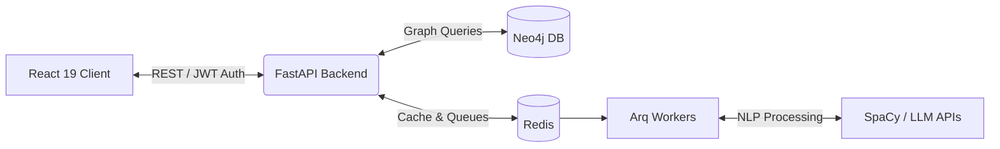

# 🚀 PropelPro AI | Enterprise Career Intelligence Platform


**PropelPro AI** is a next-generation, full-stack career intelligence platform designed to transform unstructured career data (resumes) into actionable, deterministic skill ontologies. By synergizing advanced Natural Language Processing (NLP), Large Language Models (LLMs), and Graph Database architecture, the platform dynamically analyzes technical skill gaps and engineers highly personalized, data-driven career roadmaps.

## 🌟 High-Level Architecture

The platform operates on a modernized, decoupled architecture engineered for scalability and real-time responsiveness:

- **Client Presentation Layer:** A highly responsive, fluid React 19 SPA built with Vite, utilizing Framer Motion for micro-animations and seamless state transitions.
- **API & Orchestration Layer:** A high-throughput backend powered by FastAPI (Python), providing asynchronous RESTful communication and secure JWT-based authentication.
- **Data & Relationship Plane:** 
  - **Neo4j** acts as the core graph engine, mathematically modeling complex relationships between individual skills, industry roles, and educational pathways.
  - **Redis** operates as an in-memory datastore, managing both high-speed caching and our background worker queues.
- **AI Inference Pipeline:** Integrates custom deterministic SpaCy NLP models combined with robust LLM fallback APIs (Groq/OpenAI) via to ensure high-recall skill extraction.



## ✨ Core Enterprise Capabilities

* **Automated Skill Ontology Extraction:** Rapidly ingests resumes, running them through asynchronous processing pipelines to extract and normalize skills with enterprise-grade accuracy.
* **Graph-Driven Knowledge Visualization:** Translates extracted skills into interactive, visually intuitive graph networks to uncover deep relationships between a candidate's current capabilities.
* **AI-Powered Gap Analysis:** Deterministically compares user skill configurations against aggregate live role requirements to output precise match scores and missing skill identifiers.
* **Dynamic Career Pathing:** Utilizes advanced LLM inference to automatically generate actionable learning trajectories, timeline estimates, and strategic next steps tailored to the individual.

## 🚀 Quick Start (Docker Orchestration)

The platform is containerized for immediate, reliable deployment across any environment. 

1. **Clone & Configure:**
   Clone the repository and inject your local environment configurations.
   ```bash
   cp backend/.env.example backend/.env
   cp frontend/.env.example frontend/.env
   ```
   *(Ensure you populate `OPENAI_API_KEY` in `backend/.env` with your Groq/OpenAI API key).*

2. **Spin Up the Stack:**
   Launch the entire distributed system via Docker Compose.
   ```bash
   docker-compose up --build
   ```

3. **Access the Microservices:**
   - **Frontend UI:** [http://localhost:5173](http://localhost:5173)
   - **Backend API:** [http://localhost:8000](http://localhost:8000)
   - **Interactive API Docs (Swagger):** [http://localhost:8000/docs](http://localhost:8000/docs)
   - **Neo4j Graph Browser:** [http://localhost:7474](http://localhost:7474) *(Default credentials: `neo4j` / `changeme`)*

---

## 🛠️ Local Development Specs

For granular control, development can be decoupled from Docker. 

### Backend Local Initialization
```bash
cd backend
python -m venv .venv
source .venv/bin/activate  # On Windows use: .venv\Scripts\activate
pip install -r requirements.txt
pytest --cov=. --cov-report=term-missing
```

### Frontend Local Initialization
```bash
cd frontend
npm install
npm run dev
npm run test
```

## 🔒 Deployment & Security Notes

- **Authentication:** All secure endpoints are protected via strict JWT verification. 
- **CI/CD:** Automated testing pipelines are configured via GitHub Actions (`.github/workflows/ci.yml`) to ensure production stability.
- **Environment Targeting:** Ensure `APP_ENV=production` is set prior to cloud deployment, and accurately restrict `CORS_ORIGINS` to trusted domains.
